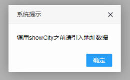

# layui-select-address
	基于layui封装了一个地址选择器，地址数据采用weui的city-picker。因为项目很多都封装在common里面，所以该common只抽出showCity和getCity方法。
## 一、用法
### 1. html写法
  `name`和`lay-filter`必须保持统一,`data-area`是地址默认值
```html
  <select name="province" data-area="广东省" lay-filter="province">
    <option value="">选择省</option>
  </select> 
```
```html
  <select name="city" data-area="广州市" lay-filter="city">
    <option value="">选择市</option>
  </select> 
```
```html
  <select name="district" data-area="天河区" lay-filter="district">
    <option value="">选择区</option>
  </select> 
```
### 2. 需引入city-picker.js地址数据文件
```javascript
<script type="text/javascript" src="js/city-picker.js"></script>
```
如果未引入，则会提示	  

### 3. layui引入common模块
```javascript
//config的设置是全局的
layui.config({
  base: 'js/' //假设这是你存放拓展模块的根目录
}).extend({ //设定模块别名
  common: 'common' //如果 common.js 是在根目录，也可以不用设定别名
});
```
### 4. 使用模块
```javascript
layui.use(['form', 'common'], function(){
  var common = layui.common,
    form = layui.form;

    //三级地址联动
    common.showCity('province', 'city', 'district');
    //监听提交
    form.on('submit(formDemo)', function(data){
      var resData = data.field,
        province = resData.province,
        city = resData.city,
        district = resData.district;

      console.log(province, city, district)

      // 通过地址code码获取地址名称
      var address = common.getCity({
        province, 
        city,
        district
      });
      console.log(address);
      return false;
    });
});
```
## 二、相关API
  common有两个方法， 
  `showCity`用来加载地址选择器，
  `getCity`用来由地址code码获取地址名称。

| 方法名 | 说明 | type |
| ------------- | ------------- | ------------- |
| showCity | [param1]省 [param2]市 [param3]县 | string |
| getCity | [option]{param1 code param2 code param3 code} | object |
